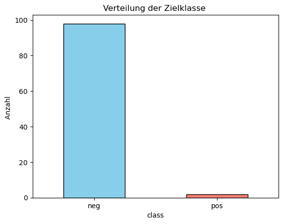
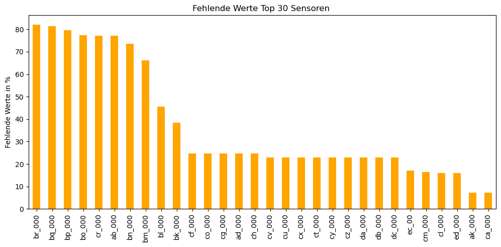
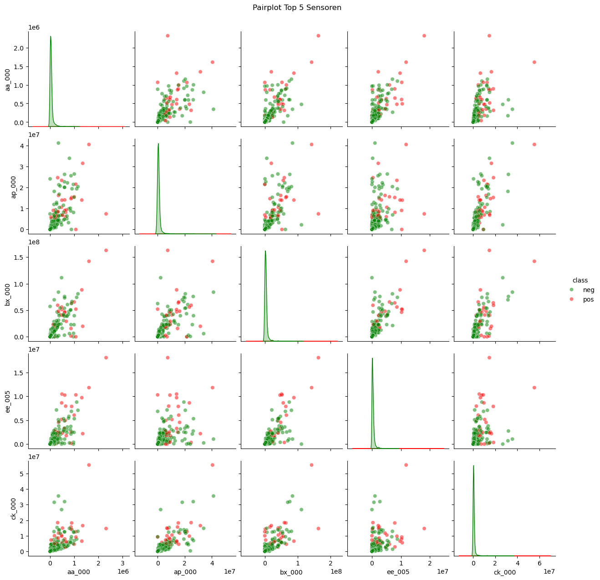
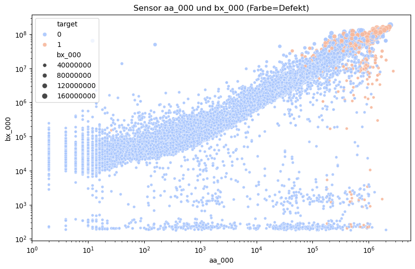
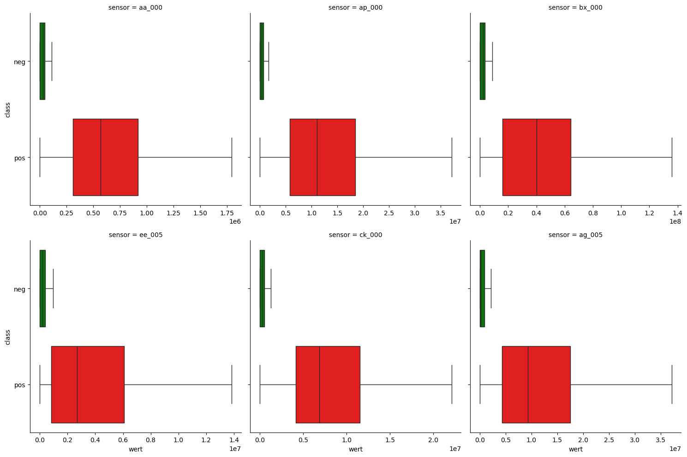
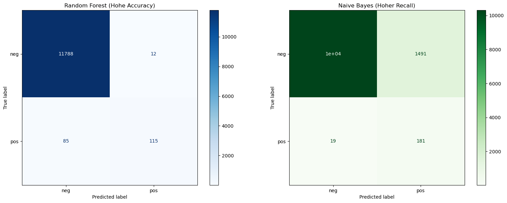
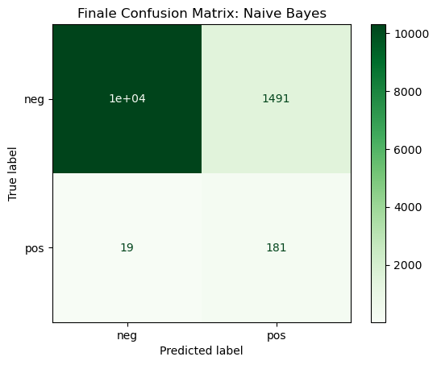

# Predictive Maintenance – Scania APS Failure Detection

**Prüfungsarbeit im Rahmen des Hochschulzertifikats »Maschinelles Lernen«**  
TH Deggendorf · Bearbeitungszeit: 1 Monat

---

## Das Problem

Das Air Pressure System (APS) erzeugt Druckluft für Bremsen und Getriebe schwerer Scania-LKWs. Fällt es aus, steht der LKW — mitten auf der Autobahn.

---

## 1. Erster Überblick und Datenstruktur

Der Datensatz umfasst 60.000 Betriebsdatensätze mit 170 Sensoren. Erster Blick auf die Zielklasse:



Nur 1,7 % der Datensätze zeigen einen echten Defekt. Das Modell lernt auf 98,3 % intakten LKWs — und soll trotzdem zuverlässig die 1,7 % finden. Klassisches Ungleichgewichtsproblem.

 Zweite Herausforderung: Alle 170 Sensoren sind **anonymisiert**. Kein Sensor trägt einen Namen, der auf seine physikalische Bedeutung hinweist 

---

## 2. Explorative Datenanalyse



Viele Sensoren lieferten kaum verwertbare Daten. Nach systematischer Prüfung wurden entfernt:

- 28 Sensoren mit mehr als 10 % fehlenden Werten
- 35 stark korrelierte (redundante) Sensoren
- 6 nahezu konstante Sensoren
- 1 vollständig konstanter Sensor (`cd_000`)

Übrig blieben **100 Sensoren** — die Grundlage für die weitere Analyse.



Physikalische Messgrößen stehen häufig im Zusammenhang und korrelieren miteinander. Aufgrund der Anonymisierung lässt sich nicht erkennen, ob bestimmte Messgrößen mehrfach erfasst wurden. Der Pairplot zeigt deutliche Korrelationen zwischen den Sensoren — redundante Merkmale wurden daher entfernt.



`aa_000` gegen `bx_000` auf Log-Skala: Defekte LKWs (pos.) bilden eine Wolke im oberen Bereich — beide Sensoren zeigen gleichzeitig hohe Werte. Intakte LKWs verteilen sich über die gesamte Fläche.



Die selektierten und bereinigten Sensoren zeigen eine klare Trennung zwischen defekten und intakten APS. Defekte LKWs (pos.) liegen fast immer im oberen Bereich — das Muster wiederholt sich bei jedem der sechs Schlüsselsensoren.

---

## 3. Datenvorverarbeitung

Auf Basis der EDA wurde eine vollständige sklearn-Pipeline aufgebaut, die alle Bereinigungsschritte automatisch ausführt:

- Entfernung von Spalten mit fehlenden Werten, Konstanten und redundanten Merkmalen
- Ausreißerbehandlung (IQR)
- Median-Imputation fehlender Werte
- Standardisierung

Die Pipeline stellt sicher, dass neue Daten genauso vorverarbeitet werden wie die Trainingsdaten — ohne manuelle Eingriffe.

---

## 4. Modellierung und Auswahl

Zwei Modelle wurden trainiert und direkt verglichen:



| Modell | Recall | Accuracy |
|---|---|---|
| Random Forest | 58 % | 99 % |
| **Gaussian Naive Bayes** | **91 %** | **87 %** |

Random Forest: Intakte LKWs zu 99 % erkannt — defekte LKWs nur zu 47 %. Das Modell übersieht mehr als die Hälfte aller Defekte.

Naive Bayes: Intakte LKWs zu 87,5 % erkannt — defekte LKWs zu 91 %. Naive Bayes findet fast alle defekten LKWs und schneidet beim Recall deutlich besser ab.

---

## 5. Evaluation des finalen Modells



91 % der defekten LKWs wurden im Testdatensatz gefunden. Von 200 defekten LKWs wurden 181 erkannt — nur 19 durchgegangen.

| | Vorhergesagt: neg | Vorhergesagt: pos |
|---|---|---|
| **Tatsächlich: neg** | 10.309 | 1.491 |
| **Tatsächlich: pos** | 19 | 181 |

**181 von 200 Defekten erkannt. Recall: 91 %.**

19 Defekte wurden übersehen (9.500 €). 1.491 Fehlalarme wurden ausgelöst (14.910 €). Gesamtkosten: ~24.410 €.

Zum Vergleich: Der Random Forest hätte bei 58 % Recall rund 84 Defekte übersehen — das entspricht 42.000 € allein an übersehenen Schäden.

---

## Projektstruktur

```
scania-predictive-maintenance/
├── issaoui_mL.ipynb          # vollständige Analyse mit allen Plots
├── issaoui_mL.pdf            # Notebook als PDF
├── scania_praesentation_final.pptx  # Projektpräsentation
├── scania_aps_model_gnb.pkl  # trainiertes Modell
├── scania_aps_pipeline.pkl   # Preprocessing-Pipeline
├── images/                   # Plots aus der Analyse
└── README.md
```

---

## Tech Stack

`Python` · `scikit-learn` · `pandas` · `NumPy` · `Matplotlib` · `Seaborn` · `joblib`

---

## Schnellstart

```python
import joblib

pipeline = joblib.load("scania_aps_pipeline.pkl")
model    = joblib.load("scania_aps_model_gnb.pkl")

X_prepared  = pipeline.transform(X_new)
predictions = model.predict(X_prepared)
# 0 = neg (kein Defekt)  |  1 = pos (APS defekt)
```

---

## Datensatz

APS Failure at Scania Trucks — Scania CV AB / UCI Machine Learning Repository (2016)  
IDA Industrial Challenge 2016  
[UCI Repository](https://archive.ics.uci.edu/dataset/421/aps+failure+at+scania+trucks)

---

## Autor

**Atef Issaoui**  
Metallograph & Werkstoffanalytiker · Maschinenbau-Student (HS Rhein-Main)  
Zertifizierter Datenanalyst (Python)  
issaouiatef@gmail.com · [github.com/ateeef](https://github.com/ateeef)
